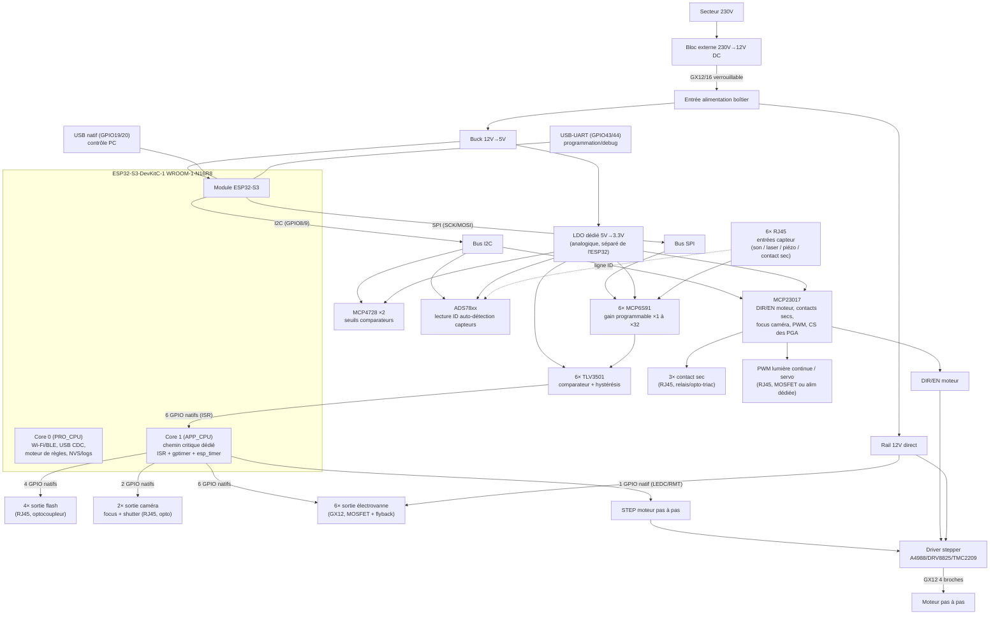

# TriggerFlow — Architecture matérielle

Boîtier de déclenchement généraliste pour photographie haute vitesse : détection multi-capteurs, moteur de règles programmable, pilotage de sorties variées (flash, électrovannes, moteur pas à pas, contacts secs, appareil photo).

Contrôlable par **USB (PC)** et **Wi-Fi/BLE (application mobile)**.

Statut : cahier des charges fonctionnel et architecture matérielle figés. Schéma électronique détaillé et firmware non encore développés.

---

## 1. Plateforme

- **MCU** : ESP32-S3-DevKitC-1, module WROOM-1-**N16R8** (16 Mo flash Quad, 8 Mo PSRAM Octal)
- **Cœurs** : dual-core Xtensa LX7, 240 MHz
- **Connectivité native** : Wi-Fi 2.4 GHz, Bluetooth LE, USB natif (device)
- Carte équipée de **2 ports USB-C** distincts sur le PCB :
  - Port USB-UART (pont série, GPIO 43/44) → programmation firmware / debug
  - Port USB natif (device, GPIO 19/20) → **contrôle PC** de l'application

## 2. Cahier des charges fonctionnel

| Paramètre | Valeur retenue |
|---|---|
| Canaux d'entrée (capteurs) | 6, génériques et reconfigurables (gain + seuil logiciels) |
| Types de capteurs supportés | Son, laser/optique, piézo, contact sec — adaptables via un front-end universel |
| Utilisation des entrées | Rarement simultanées ; les 6 canaux existent surtout pour la flexibilité de branchement, pas pour du traitement massivement parallèle en continu |
| Logique inter-canaux | Moteur de règles programmable (ET / OU / conditions avancées), pas de simple mapping 1:1 figé |
| Précision de déclenchement | ±10 µs ou mieux |
| Plage de délai programmable | De la µs à plusieurs secondes, résolution constante |
| Alimentation | Secteur (pas de contrainte de consommation) |
| Pilotage | Application mobile (Wi-Fi/BLE) **et** logiciel PC (USB) |
| Affichage local | Aucun (tout passe par l'app / le logiciel PC) |

## 3. Sorties

| Sortie | Quantité | Indépendance | Étage de puissance |
|---|---|---|---|
| Flash / obturateur (pulse simple) | 4 | Délai indépendant par canal | Optocoupleur |
| Électrovanne | 6 | Durée de pulse indépendante par canal | MOSFET + diode de roue libre (charge inductive) |
| Moteur pas à pas | 1 | STEP en natif, DIR/EN non critiques | Driver dédié (A4988 / DRV8825 / TMC2209) — pas de retour de position (rotation libre) |
| Déclenchement appareil photo | 2 sorties, **focus + obturation séparés** (4 contacts au total) | Timing indépendant | Optocoupleur par contact |
| Contact sec / relais générique | 3 | Non critique | Relais ou opto-triac |
| PWM lumière continue / servo | 1 | Non critique | MOSFET puissance ou alim dédiée régulée |

**Total : 16 sorties fonctionnelles.**

## 4. Classification des signaux : natif vs I2C/SPI

Principe directeur de l'architecture GPIO : **seul ce qui a une exigence de timing en µs reste en GPIO natif avec ISR/timer dédié** ; tout le reste (configuration, signaux lents) passe par un bus série (I2C/SPI) pour économiser les broches.

### 4.1 GPIO natifs (chemin critique)

| Fonction | GPIO natifs |
|---|---|
| 6 entrées capteurs (ISR) | 6 |
| 4 sorties flash | 4 |
| 6 sorties électrovannes | 6 |
| STEP moteur pas à pas | 1 |
| 2 sorties shutter caméra (déclenchement) | 2 |
| Bus I2C (SDA/SCL — DAC + expandeur) | 2 |
| Bus SPI (SCK/MOSI — vers les 6 PGA) | 2 |
| **Total natif** | **23 / ~25 GPIO propres disponibles** |

### 4.2 Périphériques I2C (non critique en timing)

```
ESP32-S3 (I2C : GPIO 8 = SDA, GPIO 9 = SCL)
   │
   ├── MCP4728 ×2 — DAC seuils comparateurs (8 canaux, 6 utilisés + 2 en réserve)
   └── MCP23017 — Expandeur 16 E/S
          ├── DIR + EN moteur pas à pas (2)
          ├── Contact sec / relais ×3 (3)
          ├── Focus caméra ×2 (2)
          ├── PWM lumière/servo (1)
          └── Chip Select des 6 MCP6S91 (6)
          ────────────────────────────────
          14 / 16 lignes utilisées
```

### 4.3 Chaîne d'entrée universelle (×6, identiques)

```
Connecteur capteur
   → Protection d'entrée (clamp diodes + résistance série)
   → Couplage AC/DC sélectionnable (micro/piézo = AC, photodiode/contact sec = DC)
   → MCP6S91 — Ampli à gain programmable SPI (gains ×1 à ×32, 8 pas)
   → TLV3501 — Comparateur avec hystérésis externe (résistances R1/R2), seuil piloté par DAC
   → GPIO natif ESP32-S3 (interruption)
```

- **TLV3501** choisi pour sa vitesse de propagation (~4.5 ns typ.) : totalement non limitant face à la latence ISR de l'ESP32 (~1-3 µs).
- **MCP6S91** : PGA mono-canal, SPI, gains +1/+2/+4/+5/+8/+10/+16/+32 V/V — un ampli dédié par entrée (pas de mutualisation) pour garantir que n'importe quelle combinaison de capteurs puisse fonctionner ensemble dans le moteur de règles.

## 5. Architecture logicielle (cœurs / tâches)

```
CORE 0 (PRO_CPU)                          CORE 1 (APP_CPU) — dédié chemin critique
─────────────────────                     ──────────────────────────────────────
• Pile Wi-Fi/BLE                          • ISR GPIO ×6 (entrées capteurs), IRAM_ATTR
• Serveur de contrôle USB (CDC)           • esp_timer (dispatch ISR) pour les 16 sorties,
• Tâche I2C → DAC / expandeur / PGA         délais indépendants par canal
• Tâche NVS / logging                     • Priorité maximale, xTaskCreatePinnedToCore(...,1)
• Moteur de règles (évaluation non-µs)    • Aucune tâche Wi-Fi/BLE épinglée ici
```

**Point clé** : l'ESP32-S3 ne dispose que de 4 `gptimer` matériels, insuffisant pour 16 sorties potentiellement indépendantes et simultanées. Solution retenue : le service **`esp_timer`** (timers logiciels haute résolution µs, dispatch en mode ISR pour éviter la latence de changement de contexte FreeRTOS), qui gère un nombre illimité d'alarmes virtuelles sur un seul timer matériel sous-jacent.

## 6. Mémoire

| Ressource | Usage prévu |
|---|---|
| Flash 16 Mo | NVS (presets seuils/délais/règles), OTA double-slot, firmware, LittleFS (logs horodatés) |
| PSRAM 8 Mo Octal | Non-critique uniquement : buffers réseau, historique de déclenchements — **jamais** de code/donnée du chemin temps réel (latence d'accès variable) |

## 7. Contraintes GPIO de la carte N16R8 (rappel)

- **GPIO 26-37** : indisponibles (bus interne flash/PSRAM Octal — non sortis sur le module WROOM)
- **GPIO 33-34** : non sortis sur le module, à ne jamais adresser même en logiciel
- **GPIO 0, 3, 45, 46** : broches de strapping — utilisables prioritairement en sortie, prudence en entrée
- **GPIO 19-20** : réservées USB natif (contrôle PC)
- **GPIO 43-44** : réservées USB-UART (programmation/debug)
- Tout code du chemin critique (ISR, callbacks `esp_timer`) doit être marqué `IRAM_ATTR` pour éviter les cache-miss flash

## 8. Comparatif marché (état à date de rédaction)

| Aspect | Marché (StopShot Studio = référence haut de gamme) | TriggerFlow |
|---|---|---|
| Sorties totales | 12 max | 16 |
| Sorties flash indépendantes natives | 1 (accessoire externe pour plus) | 4 |
| Axe motorisé intégré | Aucun produit identifié n'en propose | Oui (moteur pas à pas) |
| Entrées reconfigurables | Fixes ou peu nombreuses | 6, gain/seuil logiciels |
| Contrôle sans fil | Oui chez MIOPS, non chez StopShot Studio (USB uniquement) | Oui (Wi-Fi/BLE) + USB |

### Fonctionnalités confirmées au cahier des charges (logiciel, aucun impact matériel)
- **Mode "sorties désactivées"** : verrou logiciel global (armé/désarmé) évalué par le moteur de règles avant tout déclenchement. Décision actée : **désarmement logiciel uniquement via app/PC**, pas d'interrupteur physique de sécurité en façade.
- **Outils de mesure** : vitesse de projectile (calculée à partir des timestamps de deux entrées capteur sur une même trajectoire) et latence de déclenchement de l'appareil photo. Repose entièrement sur l'infrastructure de timestamping déjà prévue par les ISR — aucun composant supplémentaire.

### Point encore ouvert
- Fallback de contrôle local minimal (LED de statut) en cas de perte Wi-Fi/BLE sur le terrain — non tranché

## 9. Performance et budget de latence

### 9.1 Chaîne de latence (hors propagation physique du signal capteur)

| Étage | Latence typique |
|---|---|
| TLV3501 (comparateur) | ~5-7 ns |
| MCP6S91 (PGA, bande passante 1-18 MHz selon gain) | ~350 ns à gain max |
| Interruption GPIO ESP32-S3 | ~1-3 µs |
| Callback `esp_timer` (dispatch ISR) | voir 9.2 |
| Sortie GPIO physique | ~1-3 µs |
| **Total chemin électronique** | **~2 à 10 µs**, conforme à l'objectif ±10 µs |

### 9.2 Contrainte technique vérifiée sur `esp_timer`

- Mode `ESP_TIMER_ISR` : plancher d'environ **20 µs** pour un timer one-shot (tout délai demandé en dessous est en pratique dispatché à ~20 µs).
- Timer périodique : période minimale d'environ **50 µs**, restriction confirmée trop élevée pour la cadence du signal STEP d'un moteur pas à pas en rotation rapide.

**Décisions d'architecture qui en découlent :**
- **STEP du moteur pas à pas** : reste sur LEDC/RMT (périphérique matériel dédié), jamais sur `esp_timer` — déjà acté en sections 3/5.
- **Délais de déclenchement (flash/vannes/shutter)** : architecture hybride — délai < ~20 µs routé vers l'un des 4 `gptimer` matériels natifs (précision garantie, sans plancher), délai ≥ ~20 µs routé vers `esp_timer` (nombre de canaux illimité). Choix fait dynamiquement par le firmware selon le délai demandé.

### 9.3 Point de validation en phase de test (non tranché sur plan)
- Impact réel du trafic Wi-Fi/BLE sur le jitter des ISR du Core 1 : pas de chiffre garanti par la documentation Espressif, dépend du trafic au moment T. Mitigé par l'épinglage Core 1 dédié et le réglage du niveau de priorité d'interruption d'`esp_timer` (1 à 3). **À mesurer à l'oscilloscope sur le premier prototype**, jitter entrée→sortie avec Wi-Fi actif vs coupé.

### 9.4 Exemple d'application — impact du choix de capteur sur la précision finale
Cas : carabine à air comprimé, plomb à ~250 m/s.
- **Capteur son** : le délai de propagation acoustique (343 m/s) domine très largement le budget — à 30 cm du canon, le plomb a déjà parcouru ~22 cm avant déclenchement, contre <1 mm imputable à l'électronique. Le placement du capteur compte infiniment plus que la précision électronique pour ce cas d'usage.
- **Capteur laser (photodiode PIN + transimpédance)** : élimine le délai de propagation, ramène le déplacement du plomb pendant le délai de déclenchement à ~0,5-1,25 mm (inférieur au diamètre du plomb). Le facteur limitant devient alors la **durée d'éclair du flash** lui-même, pas l'électronique de déclenchement.
- Conclusion générale : pour les capteurs son, privilégier les cas où la source sonore est proche du sujet photographié ; pour les projectiles très rapides, privilégier systématiquement une détection optique (laser/photodiode) plutôt qu'acoustique.

## 11. Connectique — RJ45 généralisé

Choix retenu : connecteurs **RJ45 (8P8C nus, sans magnétiques/LED)** pour toutes les liaisons faible courant, à l'exclusion des vannes et du moteur pas à pas (courant/gauge de câble incompatibles avec un connecteur RJ45 standard).

**16 connecteurs RJ45 au total** : 6 entrées capteur + 4 sorties flash + 2 sorties caméra (focus+shutter) + 3 contact sec + 1 PWM lumière/servo. Implication mécanique : panneau arrière type "patch panel", probablement 2 rangées de 8.

### Pinout unifié (convention commune à tous les ports)

| Paire | Entrées capteur (×6) | Sorties simples (flash, contact sec, PWM) | Sorties caméra (×2) |
|---|---|---|---|
| Orange (1-2) | Alimentation capteur | Alimentation (réservée) | Alimentation (réservée) |
| Bleue (4-5) | Signal capteur | Signal de sortie | Shutter |
| Verte (3-6) | Masse commune / blindage | Masse commune / blindage | Focus |
| Marron (7-8) | ID auto-détection | Réservée | Réservée |

- Masse du signal séparée de la masse d'alimentation jusqu'au connecteur (évite les boucles de masse sur les canaux à fort gain PGA).
- Câble blindé (FTP/SFTP) recommandé sur les canaux micro/piézo (gain élevé, plus sensibles au bruit capté en ligne), blindage raccordé côté carte uniquement.
- Contact sec : le courant qui transite est externe (fourni par l'accessoire de l'utilisateur, pas par la carte) — documenter une limite de courant max claire, cohérente avec la tenue en courant du connecteur RJ45/câble (~1 A par broche, à vérifier selon le connecteur retenu au moment du BOM).

### Auto-détection du type de capteur

Résistance de codage sur la ligne ID (paire marron) de chaque module capteur, lue via un **ADC I2C dédié** (famille ADS78xx, 8 canaux) ajouté sur le bus I2C existant — **aucun impact sur le budget GPIO natif (23/25) ni sur le MCP23017 (14/16)**. Permet le pré-chargement automatique du gain PGA et du seuil DAC dans l'app au branchement.

## 13. Connecteurs vannes/moteur et alimentation

### Connecteurs puissance (hors RJ45) — famille GX12

Choix retenu : **connecteurs circulaires aviation GX12** pour tout ce qui est puissance (vannes, moteur, alimentation), en remplacement du JST-XH envisagé initialement — plus robustes pour un usage en façade manipulé sur le terrain (verrouillage à vis, tenue ~3-5A par broche selon variante, bien au-dessus du besoin), alors que le JST-XH est plutôt pensé pour du câblage interne de carte.

| Élément | Connecteur | Notes |
|---|---|---|
| Électrovanne (×6) | GX12 2 broches | +/- alimentation vanne |
| Moteur pas à pas | GX12 4 broches | 2 bobines (bipolaire) |
| Alimentation générale (entrée DC) | GX12 ou GX16 selon courant total | Voir section alimentation ci-dessous |

**Périmètre délibérément limité** : le GX12 reste réservé aux connecteurs de puissance. Les 16 connecteurs signal (entrées capteur + sorties logiques) restent en **RJ45** (voir section 11) — meilleur compromis coût/disponibilité de câbles préfabriqués/qualité de signal (paires torsadées) pour du faible courant, l'étanchéité renforcée du GX12 n'étant pas jugée nécessaire pour ces liaisons dans l'usage prévu. Bénéfice supplémentaire : les deux familles de connecteurs sont physiquement incompatibles entre elles, ce qui empêche tout branchement erroné (vanne sur un port capteur, par exemple).

### Architecture d'alimentation

Choix retenu : **alimentation externe déportée** (bloc secteur→DC, type chargeur), pas de 230V à l'intérieur du boîtier — évite les contraintes d'isolement/certification liées à la haute tension, cohérent avec un projet DIY non certifié.

- **Tension d'entrée** : 12V DC
- **Connecteur d'entrée** : aviation GX12/GX16 (verrouillable, robuste en usage terrain — préféré à un simple barrel jack qui peut se débrancher accidentellement)

```
Bloc secteur externe 230V→12V DC
            │
Connecteur GX12/GX16 en façade
            │
   ┌────────┼────────┐
   ▼        ▼         ▼
Rail 12V   Buck      LDO dédié
direct     12V→5V    5V→3.3V
(vannes +  (DevKitC-1, (TLV3501 ×6, MCP6S91 ×6,
 VMOT       servo,      MCP4728 ×2, MCP23017,
 stepper)   relais 5V)  ADS78xx — isolé du 3.3V
                        ESP32 pour éviter le bruit
                        Wi-Fi sur l'étage analogique)
```

Le 3.3V du DevKitC-1 (LDO embarqué) alimente uniquement le module ESP32 lui-même — un régulateur 3.3V séparé alimente toute l'électronique analogique/périphérique, pour ne pas saturer le régulateur de la carte ni coupler le bruit numérique du Wi-Fi sur les étages sensibles (PGA à fort gain notamment).

## 14. Synoptique général du montage



**Lecture du synoptique** : le chemin critique (entrées capteur → Core 1 → sorties temporisées) est entièrement natif GPIO/ISR, isolé du reste du système. Tout ce qui est configuration ou signal lent (seuils, gains, direction moteur, contacts secs, PWM) transite par les bus I2C/SPI, sans consommer de GPIO natif. Les deux familles de connecteurs (RJ45 pour le signal, GX12 pour la puissance) sont physiquement incompatibles entre elles, ce qui élimine tout risque de branchement croisé.

## 15. Ouvert / non tranché

- Schéma électronique détaillé (valeurs R1/R2 hystérésis, choix MOSFET/driver stepper, dimensionnement précis du buck 12V→5V et du LDO 5V→3.3V selon le courant total réel des périphériques)
- Référence exacte du connecteur RJ45 (tenue en courant à vérifier au BOM) et de l'ADC I2C d'auto-détection
- Courant total requis (dépend du modèle exact de vannes/moteur retenu) → dimensionnement final du bloc secteur externe
- Détail du moteur de règles (état de l'art : simple ET/OU vs langage de règles avec fenêtres temporelles/compteurs)
- Boîtier physique / mécanique (hors découpe façade USB-C déjà actée)
- Protocole de communication app/PC ↔ boîtier (USB CDC + Wi-Fi/BLE)
- Choix définitif du composant récepteur optique pour les entrées laser (photodiode PIN + transimpédance recommandé plutôt que phototransistor, pour les cas de projectiles rapides)
