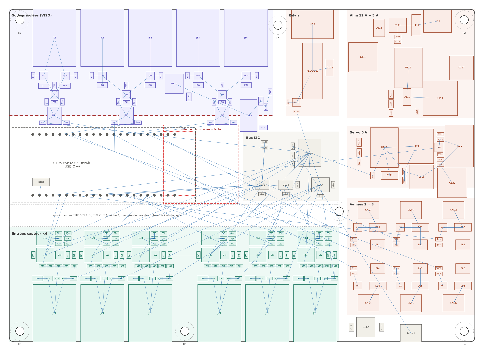

# Implantation PCB TriggerFlow (v4, 04/10/2026)

Placement des **287 composants** (export EasyEDA de référence du 05/10, servo et relais compris, sans moteur ni PWM) sur une carte **175 × 125 mm, 4 couches**. Repère : origine au coin arrière gauche, x vers la droite, y vers l'avant. Tailles = encombrements estimés, à recaler sur les vraies empreintes.

| Fichier | Rôle |
|---|---|
| `placement_TriggerFlow.csv` | référence, valeur, empreinte, X, Y, rotation, face, bloc (séparateur `;`) + trous M3 |
| `place.py` | positions de chaque composant |
| `check.py` | contrôle : chevauchements, bords, zone antenne, barrière d'isolation, trous M3 |
| `render.py` | dessin du placement et du chevelu (hors plans GND / alimentations) + 3 zooms |
| `export_csv.py` | régénère le CSV |
| `netlist_2026-10-05.json` | netlist de référence (export EasyEDA du 05/10) |

Usage : `python3 check.py && python3 render.py && python3 export_csv.py` (dépendance : matplotlib).

## Empilement (JLC 4 couches, JLC04161H-7628, 1,6 mm, cuivre 1 oz)

| Couche | Contenu |
|---|---|
| 1 (dessus) | composants et signaux, dont les signaux analogiques courts |
| 2 | **GND plein**, sans aucune piste (sauf l'îlot VISO_GND séparé) ; jamais coupé sous les bandes analogiques ni sous l'I2C |
| 3 | plages d'alimentation : **+12V** limité au quart droit (alim, servo, relais, vannes) ; **+3V3** grande plage continue au centre et à l'avant ; **+5V** en bandes étroites le long des bords (avant sous les RJ45 pour F11-F61, gauche pour la DevKit, bande verticale vers U112, tronçon sous la barrière vers U113) ; **VISO_3V3** dans l'îlot |
| 4 (dessous) | signaux longs : SPI, CS, I2C, SERVO_PWM, commandes des vannes, TLV_OUT |

Une piste de couche 4 prend son retour dans la couche 3 (noyau épais entre L2 et L3) : elle ne traverse jamais une frontière entre plages de la couche 3 (sinon condensateur de couture 100 nF ou passage en couche 1). Une piste qui doit entrer dans la zone 12 V change donc de couche avant la frontière (ex. SERVO_PWM : couche 4 puis via et couche 1 jusqu'à U122). Une piste qui traverse une bande analogique passe en couche 4, à angle droit.

## Zones (bord arrière en haut)

| Zone | x (mm) | y (mm) | Contenu |
|---|---|---|---|
| Sorties isolées (VISO) | 0–99 | 0–40 | J71, J81-J84 au bord arrière ; TVS, 2N7002, 74LVC2G04, HCPL-063L |
| Barrière d'isolation | 0–99 | y = 40 | seuls U71, U81, U83, U113 à cheval ; ≥ 3 mm sans cuivre sur les 4 couches |
| Relais | 104–124 | 0–40 | J122 au bord arrière, RELAY121, Q121, D122 |
| Alimentation 12 V → 5 V | 127–175 | 0–41 | J111 dans le coin ; flux J111 → F111 → Q111 → D111 → C112 → U111 → D112 / L111 → C117 |
| ESP32-S3 DevKit | 1–70 | 44,5–72,5 (U105 en y = 58,5) | USB-C au bord gauche ; antenne vers l'intérieur |
| Zone antenne | 58–86 | 43,5–73 | sans cuivre sur les 4 couches, fente fraisée sous l'antenne (≈ 12 × 24 mm) |
| Bus I2C | 88–124 | 46–72 | U101 MCP23017, U102/U103 MCP4728, U104 ADS7828 |
| Couloir de bus | 0–124 | 73,5–81,5 | THR / CS / ID / TLV_OUT en couche 4 ; rangée de vias de couture côté analogique |
| Servo 6 V | 127–175 | 44–69 | U121, L121, D121, C125, U122 ; C127 et J121 (bornier) au bord droit |
| Vannes 2 × 3 | 127–175 | 71–115 | CN91-CN96 en 2 rangées miroir, rail +12V central ; D9n entre CN9n et Q9n |
| Entrées capteur ×6 | 0–124 | 82–125 | J11-J61 au bord avant (x = 17, 35, 53, 79, 97, 115), bande de 18 mm par voie |
| +3V3 et LED | 128–175 | 115–125 | U112, CN101 |

**Trous M3** : H1 (4, 4) et H5 (101, 6) côté VISO en **NPTH** (jamais reliés à la masse) ; H2 (171, 4), H3 (4, 121), H4 (171, 121), H6 (66, 121) en GND ; H7 (124, 76) optionnel. Exclusion de 7 mm de diamètre autour de chaque trou.

## Règles clés appliquées au placement

- Chaque voie d'entrée suit le trajet du signal : RJ45 → TVS/PTC → R16 / BAT54S / C12 → MCP6S91 → TLV3501 → TLV_OUT vers la rangée J1 de l'ESP32. TLV_OUT (fronts de 4,5 ns) ne longe jamais l'entrée CLAMP du PGA ; filtre THR (R13/C11) collé à la broche 2 du TLV3501.
- Découplages à ≤ 2 mm de leur broche, via GND juste à côté.
- Boucles de découpage courtes (C112 → U111 → D112 ; C122/C123 → U121 → D121), ≈ 15 vias thermiques sous les languettes de U111 et U121 (deux plans internes à traverser), électrolytiques à ≥ 5 mm des languettes, L111 et L121 à 90° et ≥ 10 mm.
- Pistes +12V, VALVE_PWR, VALVE_SW ≥ 2 mm ou plages ; ≥ 2 vias par source de MOSFET (Q91-Q96, Q121) vers la couche 2.
- Isolation : aucune piste, via ou plan ne traverse la barrière hors U71/U81/U83/U113 ; bande sans cuivre sous U113 ; blindages J71/J81-J84 non connectés ; ≥ 3 mm entre la zone relais (GND) et l'îlot VISO.
- Tout sur la face du dessus (assemblage JLC simple face) ; 3 fiducials ; ≥ 0,5 mm entre cuivre et bord.
- Points de test : +12V, +5V, +3V3, VISO_3V3, V_SERVO, GND, VISO_GND, I2C_SDA/SCL, SPI_MOSI/SCK, TLV_OUT_1 à 6.
- Sérigraphie : V1 à V6 et + / − près de CN91-CN96 ; « BASSE TENSION, 30 V max, jamais de 230 V » près de J122 ; numéro de voie près de chaque RJ45 ; marquage de la zone isolée.

Checklist complète à cocher : [docs/pcb-checklist.md](../docs/pcb-checklist.md).

## Changements par rapport au plan de zones initial

- Couloir de bus de 8 mm (y 73,5–81,5) à la place de la bande de garde : les 24 liaisons THR, CS, ID et TLV_OUT y passent en couche 4. L'ESP32 remonte de 3 mm.
- U113 (B0505S) déplacé sous J84 : il était dans l'axe de l'antenne.
- U114 au centre de l'îlot isolé (alimente les trois optos répartis sur toute la largeur).
- Servo et relais repris avec les repères EasyEDA du 05/10 : J121 et J122 sont des borniers KF128 3P (15,8 × 10,7 mm) ; J121 recentré (x = 169,15), L121 décalé à x = 153, petits composants du servo replacés en colonne à x ≈ 162, C127 (470 µF) sous J121, RELAY121 descendu à y = 23,2, J122 à y = 5,7.

## Encore approximatif / à confirmer

- Empreinte exacte du RJ45 HanXia C25168869 (largeur supposée 16 mm, pas de 18 mm), dimensions de la DevKit, du relais.
- Rotation 0 = orientation par défaut de l'empreinte : vérifier la broche 1 sur la bibliothèque réelle.
- Dégagement autour des connecteurs de vannes de la 1re rangée ≈ 1,5 mm entre C127 et CN93 (5 mm visés) : à reprendre avec les vraies empreintes.
- Boîtier plastique ou métallique (métallique → carte WROOM-1U à antenne externe u.FL, à décider avant routage).
- Application dans EasyEDA Pro : saisie manuelle ou Claude Code + easyeda-copilot lisant le CSV (déplacer une empreinte sur le PCB ne casse pas les liaisons).
